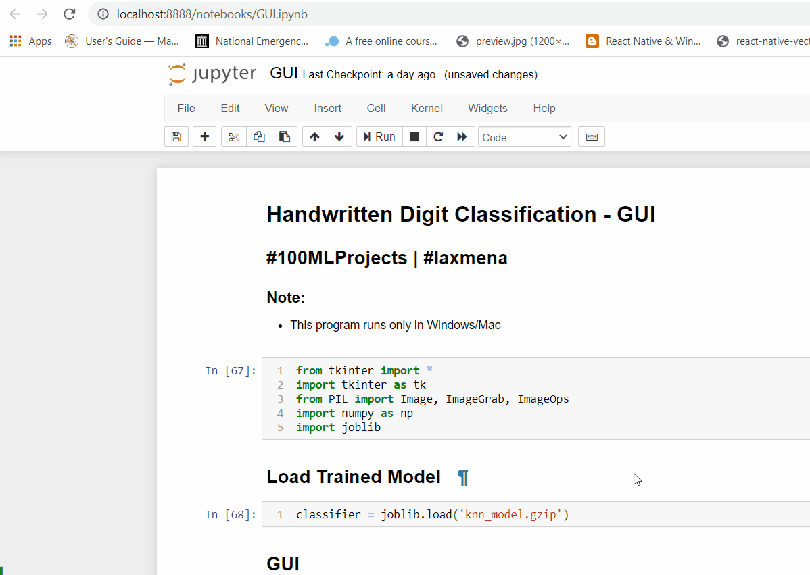

# Project 2 - Handwritten Digit Recognition

MNIST Handwritten Digit Classification is a widely popular Machine Learning problem which every Machine Learning Engineer would have experimented on in some point of their initial career.

In this project, I'll build a Machine Learning model which predicts a Handwritten Number.

Dataset: [MNIST Database](http://yann.lecun.com/exdb/mnist/)

**KNN Classification** and **SVM Classification** models are used in this project.

This project also has a GUI, where the user can draw a digit in the canvas and make the Machine Learning model predict the digit.

More informaiton are available in this Blog Article: [Project2 - Handwritten Digit Recognition](#)

**Here is a Demo of the Project:**

