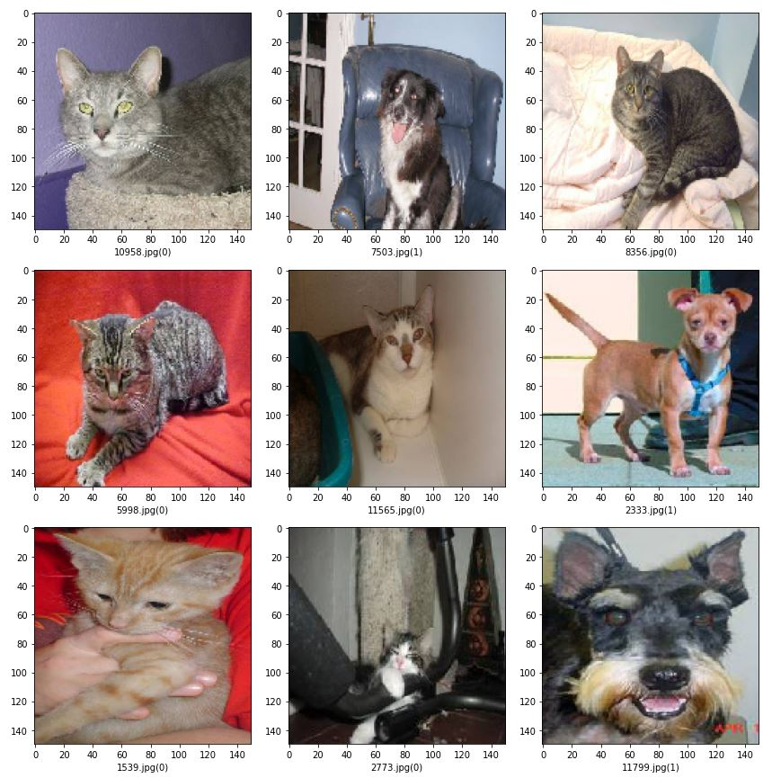
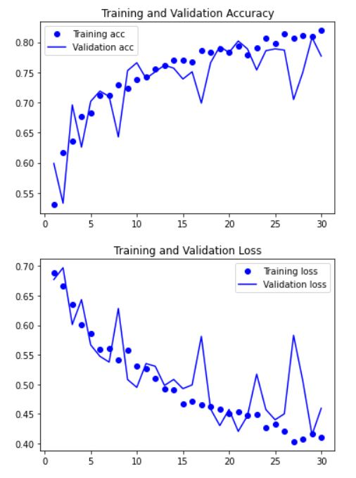
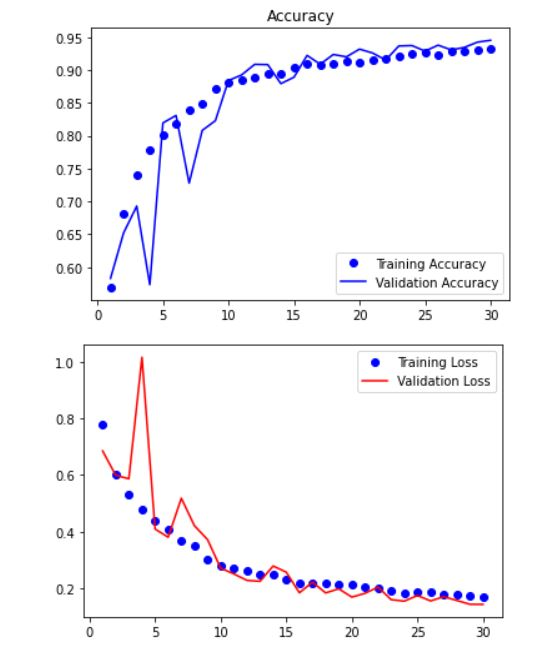

# #Project5 - Dogs vs Cats Image Classification using CNN

Kaggle Dataset [Dogs vs Cats]() has 25000 images of dogs and cats, and it is a perfect dataset to create a classification model.

For this problem, Ill use Deep Learning, Convolutional Neural Netowrks in specific to build a model that classifies a given image as either a dog or a cat.

Convolutional Neural Networks are really powerful technique, especially in the context of images and computer vision. They are good at learning hidden patterns from the training data.

## 1. Naive CNN Model

- I built a basic CNN model with only few layers. Also I used only a subset of the full dataset that is available, I used 2000 images from the training dataset to train the model.
- This model doesnt require a GPU to train, a normal CPU is suffice.
- This model uses a sigmoid activation function in the last fully connected layer.
- This model at best achieved validation accuracy of ~81% 
Here is the visualization of training and loss values for this model:

IPynb Notebook: [Dogs_vs_Cats 2000_imgs](https://github.com/laxmena/100MLProjects/blob/master/Project5%20-%20Dogs%20vs%20Cats/Dogs_vs_Cats%202000_imgs.ipynb) 
Saved Model: [cats_vs_dogs_1.h5](https://github.com/laxmena/100MLProjects/blob/master/Project5%20-%20Dogs%20vs%20Cats/cats_vs_dogs_1.h5)

**Validation Accuracy: ~81%**

## 2. CNN Model from Scratch trained on 20K images
-  This model is built on the insights from the previously built Naive CNN model.
- This model has extra layers to extract more information from the training data
- Trained over 20,000 images, and uses augmentation, dropout, batch normalization techniques to prevent overfitting.
- This model is computation heavy and requires a GPU to finish training process.
- This model can be run on Google Colab, make sure GPU is enabled for the notebook in the runtime.
- Achieved maximum Validation accuracy of ~94.5% and minimum validation loss of 0.1431

Here is the visualization of training and loss values for this model:

This model doesnt seem to overfit, and I ran only 30 epochs. This model could be improved further by running for more epochs until it starts to overfit.

**Validation Accuracy: ~94.5%**

IPynb Notebook: [Dogs_vs_Cats FullDataset](https://github.com/laxmena/100MLProjects/blob/master/Project5%20-%20Dogs%20vs%20Cats/Dogs_vs_cats%20FullDataset.ipynb) 
Saved Model: [dogs_vs_cats_3_2.h5](https://github.com/laxmena/100MLProjects/blob/master/Project5%20-%20Dogs%20vs%20Cats/dog_vs_cat_3_2.h5)
