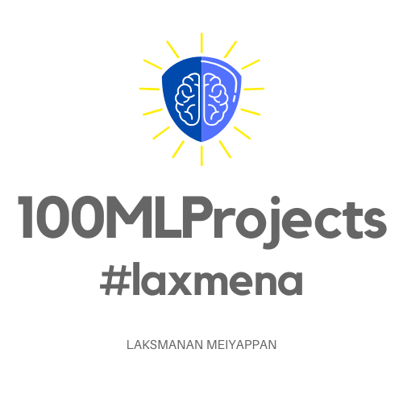

<!-- # 100MLProjects -->

## About #100MLProjects:
100MLProjects is a Challenge where I try to attain proficiency in Machine Learning and Deep Learning concepts by doing 100 Projects. The complexity of the projects keeps increasing as I progress through the challenge, so other Machine Learning/Deep Learning aspirants can also follow this path.

## List of Projects
1. Predicting Graduate Admissions : [GitHub Repo](https://github.com/laxmena/100MLProjects/tree/master/Project1%20-%20Graduate%20Admissions%20Prediction) | [Blog Article](https://medium.com/@laxmena/project-1-of-100mlprojects-predicting-graduate-admissions-laxmena-dd6d140c052e?source=---------3------------------) 
- Start: June 12, 2020 | Completion: June 13, 2020

2. Handwritten Digit Recognition : [GitHub Repo](https://github.com/laxmena/100MLProjects/tree/master/Project2%20-%20Digit%20Recognition) | [Blog Article 1](https://medium.com/@laxmena/project2-of-100mlprojetcs-classification-mnist-digit-recognition-d9208856f1f2) | Blog Article 2
- Started: June 16, 2020 | Completed: June 18, 2020

## Feedback and Suggestions
If you have suggestions and feedback regarding this challenge, please leave me a message through [LinkedIn]() or by email: <lakshmanan.meiyappan@gmail.com> .

## About Me
I'm __Lakshmanan Meiyappan__, a Software Engineer and an AI Student. I worked a couple of years in a Multi-National Software company, building Enterprise Softwares for large instituitions and organizations. Now I'm on a break from the professional world, to develop and equip myself by getting into Academia! I'm joining my Masters program in Fall 2020.

Do Checkout my LinkedIn and Medium Profiles
- LinkedIn: https://www.linkedin.com/in/lakshmanan-meiyappan/
- Medium: https://medium.com/@laxmena
